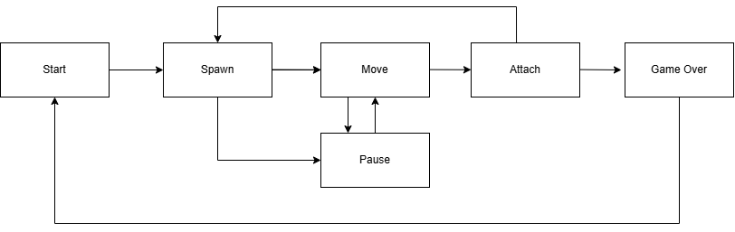

# TetrisGame

Игра «Тетрис» на языке программирования С с использованием структурного подхода.

- Программа состоит из двух частей: библиотеки, реализующей логику игры тетрис, и терминального интерфейса с использованием библиотеки `ncurses`.
- Для формализации логики игры использован конечный автомат.  

- Сборка программы с помощью Makefile:  all, install, uninstall, clean, dvi, dist, test, gcov_report. 

Управление:
  - Стрелка влево — движение фигуры влево,
  - Стрелка вправо — движение фигуры вправо,
  - Стрелка вниз — падение фигуры,
  - Стрелка вверх- действие (вращение фигуры) .

В игре также есть:
- подсчет очков;

Начисление очков будет происходить следующим образом:

- 1 линия — 100 очков;
- 2 линии — 300 очков;
- 3 линии — 700 очков;
- 4 линии — 1500 очков.

- механика уровней.
Каждый раз, когда игрок набирает 600 очков, уровень увеличивается на 1. Повышение уровня увеличивает скорость движения фигур. Максимальное количество уровней — 10.
